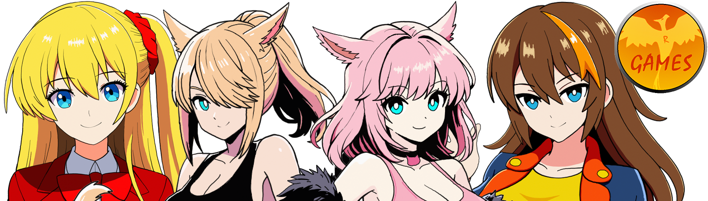

# Hi, I'm Aldo!

I'm a Lead Software Development Engineer and indie game developer behind **Crimson R Games**.

By day, I work as a software engineer leading and building production-grade systems.  
By night, I create games, stories, tools, and experiments driven by a lifelong passion for interactive worlds.

I started dreaming about making games when I was a kid playing **Super Mario World**, and that dream eventually became **Crimson R Games**, my one-person studio where I explore game design, storytelling, programming, and digital worlds.

---

## GitHub Stats

  

  
  

> This profile focuses on my personal, public, and indie game development work.  
> Professional contributions in private company repositories are intentionally not included.
---

## What I like building

I'm especially interested in:

- Games
- Webapps
- Systems that combine engineering, creativity, and design

---

## Crimson R Games

**Crimson R Games** is my personal game development studio and creative space.

  

Through it, I work on original games, characters, and interconnected stories. One of my long-term creative goals is to build a universe of games that can eventually connect together into a big story.

---

## Tech & Tools

### Game engines

- Ren'py
- Unity
- Godot
- Phaser

### Frontend

- React
- Angular
- Tailwind

### Backend

- Java
- Python

For Mobile I prefer doing natively, Android Studio + Kotlin, Xcode + Swift, but it's been a long time since I last touched anything mobile. 
For Machine Learning I am somewhat familiar with SKLearn, Pandas, OpenCV.

---

## Current Focus

Right now, I'm exploring and building ideas around:

- Reviving my old Razor-X game in modern Unity 6 (it was developed 10 years ago in Unity 4.3 - 5)
- Working on porting Wavy to Godot 4 and complete the game.
- Making some games for my MininAIs
- Getting the Colors of Love Re-colored ready to be launched on STEAM.

---

## My Development Philosophy

I believe good software and good games both come from the same place:

> Clear ideas, thoughtful systems, iteration, and care for the people who will use or play them.

As an engineer, I care about maintainability, reliability, and clarity.  
As a game developer, I care about emotion, feel, personality, and fun.

The best projects are where both sides meet, built with love, care and passion.

---

## Find Me

- GitHub: [@aldoram5](https://github.com/aldoram5)
- Studio: [Crimson R Games](https://crimsonrgames.com)
- itch.io: [aldoram5](https://aldoram5.itch.io)
- gamejolt.io: [aldoram5](https://gamejolt.com/@aldoram5)
- pixiv: [aldoram5](https://www.pixiv.net/en/users/43804990)
- Steam: [CrimsonRGames](https://store.steampowered.com/developer/CrimsonRGames)
- Youtube: [aldoram5](https://www.youtube.com/@aldoram5)
- email: [aldo@crimsonrgames.com](mailto:aldo@crimsonrgames.com)
- stackoverflow: [aldoram5](https://stackoverflow.com/users/4142609/aldoram5)

You can read my Blog [here](https://aldoram5.github.io).

Thanks for stopping by!
